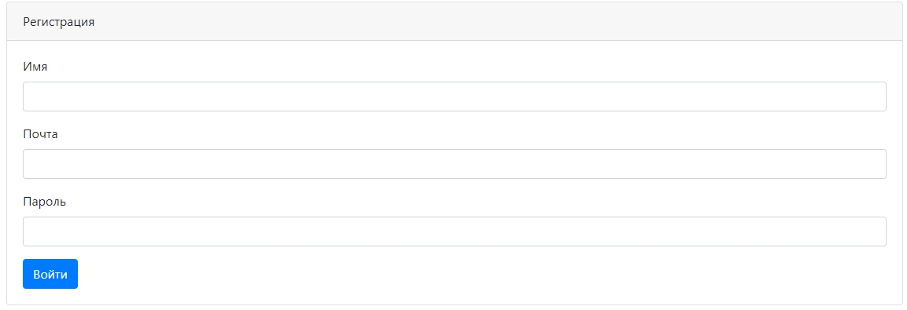
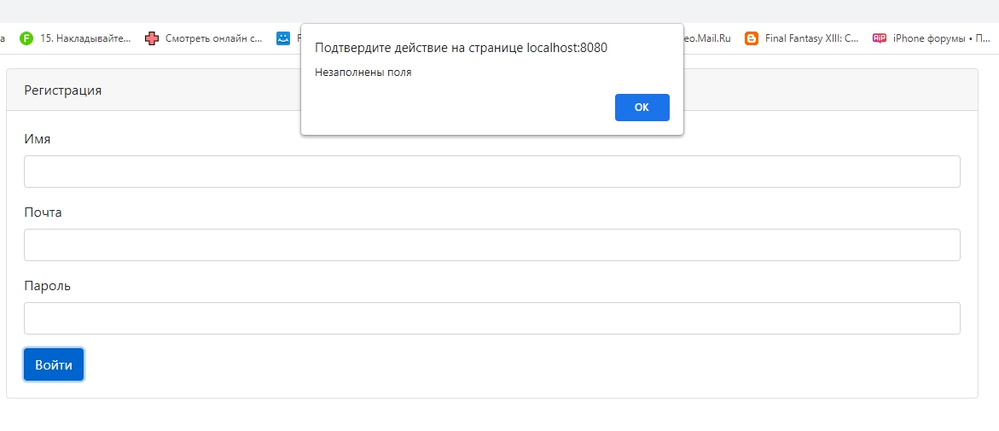
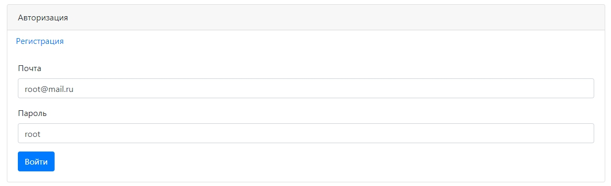
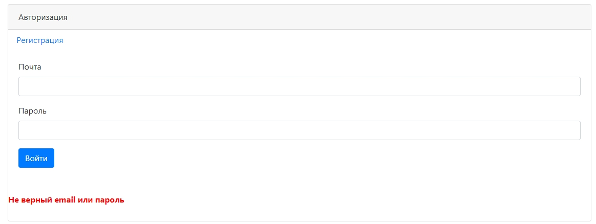
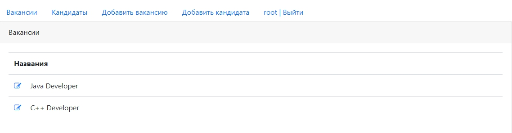
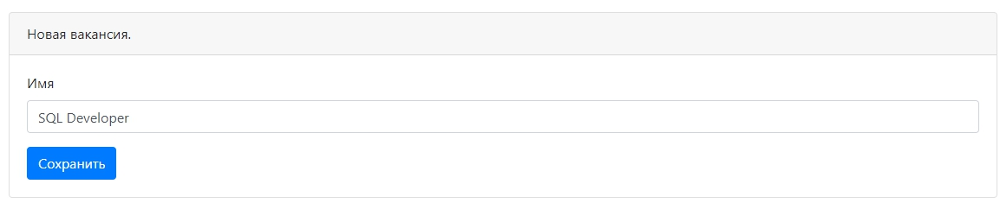
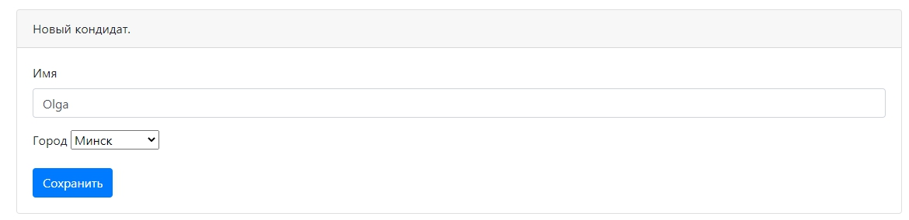
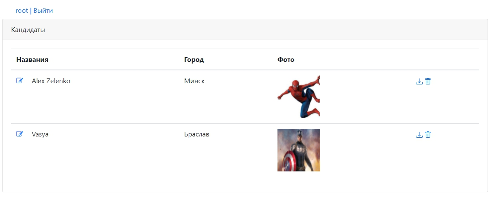

### Web-application for searching and adding vacancies and candidates

Технологии:

Java Servlet API

Apache Tomcat

JDBC

PostgreSQL

JS (jQuery, AJAX), JSP, HTML

Junit, Mockito, PowerMockito

Log4j, Sl4J 

Maven

Travis CI, CodeCov, CheckStyle

### Page of Registration

###Page of Authorization

###Page of Vacancies

### Add Vacancies

### Add Candidate

###Page of Candidates

